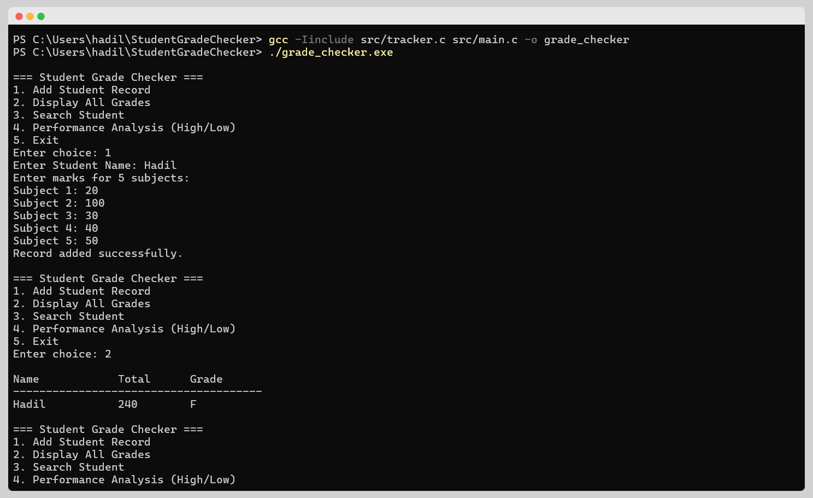

<div align="center">

  

  # 🎓 Student Grade Checker
  
  **A C Console Application for Automated Grade Calculation and Analysis.**

  <!-- Badges -->
  <p>
    
    
    
  </p>

</div>

## 📖 Introduction
This project automates the manual grading process for schools and colleges. It allows users to store student details, calculate grades based on marks, and analyze class performance.

It utilizes specific data structures like **2D Arrays** for marks and **Parallel Arrays** for names and grades to manage data efficiently in a C console environment.

---

## 🚀 Key Features

| Feature | Description |
| :--- | :--- |
| **📝 Add Records** | Input student names and marks for multiple subjects. |
| **📊 Auto-Grading** | Automatically calculates totals, averages, and assigns grades (A-F). |
| **🔍 Search** | Linear search algorithm to find specific student details by name. |
| **📈 Analysis** | Identifies the Highest and Lowest scorers in the batch. |

---

## 💻 Output Screenshot

<div align="center">
  <!-- Replace with your actual screenshot -->
  <a href="assets/output.png" target="_blank">
    
  </a>
</div>

---

## 🛠️ How to Run

1.  **Compile:**
    ```bash
    gcc -Iinclude src/tracker.c src/main.c -o grade_checker
    ```

2.  **Run:**
    ```bash
    ./grade_checker.exe
    ```

## 👨‍💻 Author
**Hadil KK**
***BE-CSE, KIT-CBE***